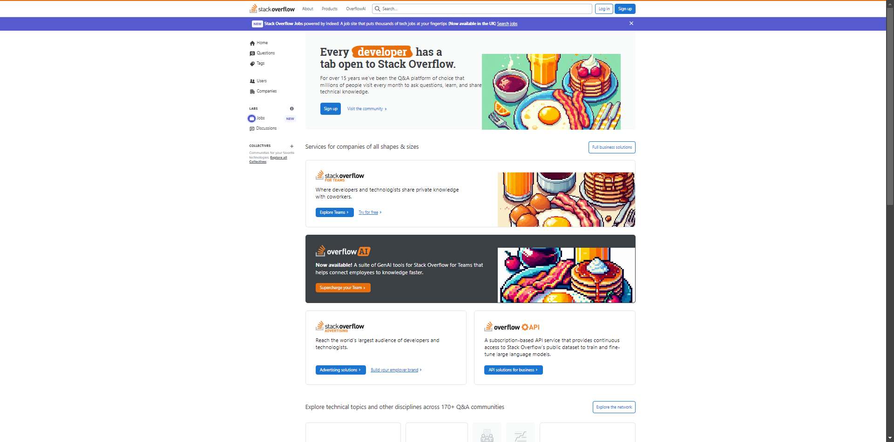

#  TakeABreak
*"How about a browser extension that randomly turns website images into pixel art of breakfast foods?" - High Seas, HackClub (dino!)*

# Introduction
Have you ever thought to yourself "why should I have to endure these minimalist, useless and corporate images on a webpage"? Fear no more with TakeABreak! Instead of having to endure the suffering of oversimplification, you can now withstand the state of the internet with the automatic replacement of these images with **images of breakfast and food instead!**

You might ask "why breakfast"? Well, you can't exactly surf the internet on an empty stomach, and I think it fits quite well.

# Public Release
I have sent a request to publish this on the Chrome Web Store. It is currently awaiting review. If you'd like to install this extension, follow the Installation instructions below! I assure you it's worth it!

# Images

_Brave Search_

_YouTube_

_Roblox_

_StackOverflow_

# Installation
- Download the .zip file (Code -> Download ZIP).
- Extract the .zip file.
- Go to `chrome://extensions` _(or similar!)_
- Enable `Developer Mode`
- Select "Load unpacked"
- Select the extracted folder

# FAQ
### "I don't see the point.."
I generated this idea using the Dinosaur on the HackClub main page - hence the quote at the top of this README. I think it serves a purpose, to avoid the distractions on a webpage!
- No need to worry about your user avatars on a webpage, as your and other people's avatars will just become breakfast images!
- No need for concern about uncentered or unfitting images for a webpage! It'll become food!
- A site you regularly use changed their logo, and it's now way too minimalist and annoying! Worry no more, it's now food!

### What's the "backend" server for?
Due to Chrome's weird Content-Security-Policies and accessing local images being a massive nightmare, I quickly spun up a server to serve the image files in a secure manner. You don't need to edit the host as I bought a VPS just to keep that server online. However, if you want to host the backend yourself, the `requirements.txt` and the full code is available in the `backend` folder.

### Why is there "optional/external_libs"?
So, I created the options page with Tailwind and Flowbite classes... and then when I tested it, none of them worked! I checked my console and it was also due to a weird chrome CSP! Tried whitelisting the CDN to no avail, where the only fix I thought of was to locally include the libraries on build.

The following libraries are locally downloaded for it:
- [Flowbite](https://cdn.jsdelivr.net/npm/flowbite@3.0.0/dist/flowbite.min.js)
- [Tailwind CSS](https://unpkg.com/@tailwindcss/browser@4)

# Credits
- @MikeyUsersREC; code

